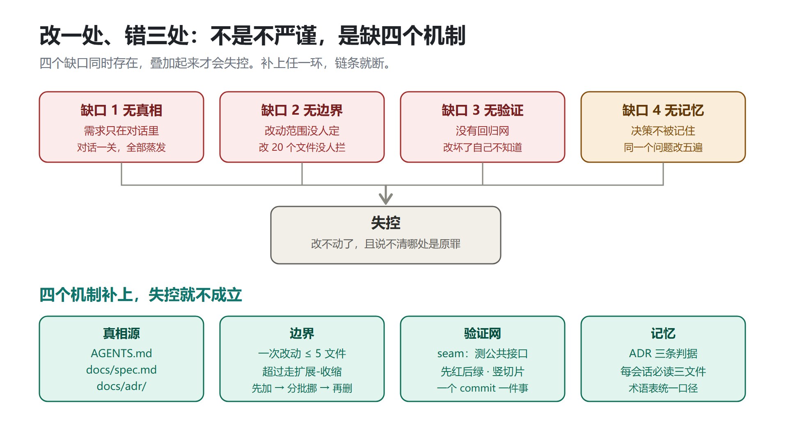
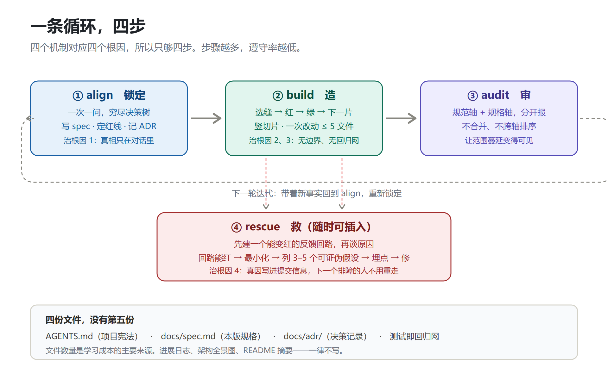

# AI 编程失控治理：一套极简规范与方法论

**从"改一处错三处"到"改一处只错一处"**

版本 V1.1 ｜ 2026-10-06 ｜ MIT License

---

## 这份文档怎么用

**给 AI 看：**把本文放进项目根目录（推荐 `AI-CODING-RULES.md`），并在 `AGENTS.md` 里加一行：

```
开始任何工作前，先完整阅读 AI-CODING-RULES.md，并把它当作本项目的硬约束执行。
```

**给人看：**开工前读一遍第一节（四个机制）和第六节（速查卡），其余按需查。

**为什么需要它：**AI 写代码快，但"改一处、错三处"这件事本身不是 AI 变笨了，而是**缺机制**。本文给出四个机制、四个动作、三份文件，全部规则开源可溯源。

---

## 一、四个机制：为什么改一处会错三处

项目迭代到中后期失控，通常同时存在四个缺口。它们叠加，才形成"改不动了、且说不清哪处是原罪"的局面。



### 怎么读这张图

上半部分是**四个缺口**，也就是失控的四个来源；下半部分是**对应的四个机制**。两者是一一对应的：补上哪个机制，就堵住哪个缺口。

### 缺口 1：真相只在对话里 → 机制一「真相源」

需求、决策、"为什么不那么写"，这些全部只存在于聊天记录里。

对话一关，全部蒸发。下一个 agent（或下周的你）打开项目，看到的只有结果代码，**读不出任何意图**。于是它只能猜，它猜错了你也没发现——因为没有东西能对照。

> 这就是"错三处"的第一层：不是改错了，是**改的时候不知道自己在改什么语义**。

**机制对策：**把决定写进仓库，让仓库自己携带意图。见第三节「三份文件」。

### 缺口 2：改动范围没人定 → 机制二「边界」

人类工程团队有 Code Review 兜底：改20 个文件，reviewer 一定会问"这为什么"。

AI 写代码是快，review 跟不上。20 个文件的改动一次性落盘，逐行根本看不完。

**后果不是"有 bug"，是"没人知道哪些 bug 是这次引入的"。**测试挂了不知道是新改的还是旧的，git log 一片混乱，问题无法二分定位。

**机制对策：**给改动设一个**看得见的量**，越界就换策略。见第二节「边界」。

### 缺口 3：没有回归网 → 机制三「验证网」

没有测试，或者只有几个"能跑就算过"的冒烟测试。

于是每一次改动都是**赌博**：改完不知道有没有弄坏别的地方，只能靠手动点。点出来的问题修，没点出来的继续埋。

**项目越大，赌输的概率越高。**这就是为什么"项目到了最后"才失控——不是最后才出问题，是最后才发现。

**机制对策：**测试挂在**公共接口**上，先红后绿。见第二节「验证网」。

### 缺口 4：决策不被记住 → 机制四「记忆」

第三个 agent 遇到第五次出现的老问题，又问一遍；又做出一个和上次不一样的选择。

**不一致的同类实现分散在各处**，谁也说不清哪个是对的。这就是"错三处"的第二层：一个 bug 存在三份实现，修了一处，另两处还在。

**机制对策：**用 ADR 把"为什么这么定"记下来，用术语表把口径统一。见第二节「记忆」。

---

## 二、四个机制怎么落地

### 机制一：真相源——三份文件，没有第四份

| 文件 | 放什么 | 什么时候写 | 生命周期 |
|---|---|---|---|
| `AGENTS.md`（根目录） | 项目宪法：怎么构建、怎么测试、**不可越界的红线**、项目特有术语 | 项目第一版| 项目第一版，之后极少变 |
| `docs/spec.md` | 本版规格：做完长什么样、验收清单、**这一版明确不做什么** | 每次开工前 | 每次重写 |
| `docs/adr/NNNN-*.md` | 决策记录：一个决定 + 为什么 | 只在满足三条判据时 | 只增不删 |

**没有第四类文件。**不写进展日志、不写架构全景图、不写 README 摘要。

> **理由：文件数量是学习成本的主要来源。**三个文件，一眼能记住；八个文件，每个都要先判断"这个该写哪儿"。

**第四份是测试。**它不是文档，但它是回归网本身。

#### 关键：`docs/spec.md` 写什么、不写什么

```markdown
# 本版规格：用户可撤销已提交订单

## 做完长什么样
用户在订单详情页点击「申请撤销」后，订单进入「撤销审核中」状态；
管理员在后台看到待审队列，可以批准或驳回；批准后订单恢复为「已取消」，
驳回则恢复原状态并通知用户。

## 验收清单
- [ ] 只有「已支付且未发货」的订单能进入撤销申请
- [ ] 已发货订单点撤销按钮时提示「发货后不可撤销」，且不发起请求
- [ ] 管理员驳回后用户收到站内通知
- [ ] 重复点击「申请撤销」不产生第二条申请记录

## 这一版明确不做
- 不做退款流程（下一版做）
- 不做批量撤销
- 不改移动端布局

## 需要改动的地方
- 订单状态机（新增两个状态与合法迁移）
- 订单详情页操作区（新增撤销入口）
- 后台待审队列（新增列表页）
```

**对照写法（错的）：**

```markdown
## 需要改动的地方
- 在 Order 实体加 status 字段，枚举加 ORDER_REVOKING、ORDER_REVOKE_REJECTED
- 修改 src/order/service/order-service.ts
- 新增 src/order/api/revoke-controller.ts
```

差别在哪？**前者说的是行为与验收，后者说的是实现。**

文件路径和代码片段**今天对、明天就过期**，写进规格只会变成误导。规格要能在三个月后仍然可读。

#### `AGENTS.md`：一屏以内

```markdown
# 项目宪法

## 怎么看懂这个项目
构建：`pnpm build`　测试：`pnpm test`　单测：`pnpm test <file>`
类型检查：`pnpm typecheck`（提交前必过）
目录：`src/domain/` 业务规则 · `src/api/` 接口 · `src/infra/` 外部依赖

## 红线（越过就算错）
- 业务代码禁止直接 import `src/infra/` 之外的东西，一律走 `src/api/`
- 禁止在 Controller 里写业务逻辑，必须下沉到 `src/domain/`
- 新增工具函数前先搜 `src/utils/`，不允许重复造

## 术语
**订单**：用户下单产生的交易主体，状态机见 docs/spec.md
**撤销**：用户在已支付未发货时可发起，进入审核；与「取消」不同，不触发退款
```

**超过一屏就该砍。**它每次会话都要加载，臃肿就是浪费。

### 机制二：边界——一次改动 ≤ 5 个文件

**这是唯一一条需要强制执行的规则，也是整套方案里最关键的一条。**

超过 5 个文件，**不要直接改**。改走**扩展-收缩**：

1. **扩展**：把新形态加在旧形态旁边，此时旧代码仍能工作，什么都不坏
2. **迁移**：按目录/包分批把调用点挪过去，每批一次提交，**每批之后都是绿的**
3. **收缩**：确认没有调用方了，删掉旧的

对非程序员的话：**不要一次全改。**

> 慢20%，但不会让你在中途回不了头。

**什么算"一个改动"：**一个 commit = 一个逻辑变更。如果你在提交信息里需要写"以及"、"顺便"、"同时"，就该拆开。

> **为什么是 5？**它不是数学结论，是经验阈值：5 个文件的改动，人还能一遍看完；20 个就看不了了。关键不是 5 这个数字，是"**超了就要换策略**"这个触发机制。

### 机制三：验证网—— seam + 先红后绿 + 竖切片

#### 缝（seam）

> **缝 = 你能观察行为、又不用钻进里面的那个公共接口。测试只写在缝上，不测内部实现。**

- 优先用**已经存在**的公共接口
- 需要新缝时，**在尽可能高的层**开缝
- **缝越少越好**，理想是一个
- **缝的位置必须先跟用户确认**

这解决"错三处"里最隐蔽的一层：**测试挂在内部实现上，重构一下就全红，红了就会乱改回去**——于是为了保住测试而不重构，代码越来越僵。

#### 好测试 vs 坏测试

```typescript
// 好：通过公共接口验证行为，重构不会崩
test("用户能用有效购物车结账", async () => {
  const cart = createCart();
  cart.add(product);
  const result = await checkout(cart, paymentMethod);
  expect(result.status).toBe("confirmed");
});

// 坏：断言内部调用，一重构就崩
test("checkout 调用了 paymentService.process", async () => {
  const mock = jest.mock(paymentService);
  await checkout(cart, payment);
  expect(mock.process).toHaveBeenCalledWith(cart.total);
});
```

坏测试的红旗：mock 内部协作者、测私有方法、断言调用次数、绕过接口去查数据库。

还有一个更隐蔽的坏测试——**同义反复**：

```typescript
// 坏：期望值用实现自己的算法再算一遍，永远不会失败
test("calculateTotal 汇总行项目", () => {
  const items = [{ price: 10 }, { price: 5 }];
  const expected = items.reduce((sum, i) => sum + i.price, 0);
  expect(calculateTotal(items)).toBe(expected);
});

// 好：期望值是独立的已知真值
test("calculateTotal 汇总行项目", () => {
  expect(calculateTotal([{ price: 10 }, { price: 5 }])).toBe(15);
});
```

**同义反复的测试给出的是假信心**——它在任何实现下都通过，包括完全错误的实现。这是"有测试但照样失控"的主因之一。

#### 先红后绿

1. **红**：先写一个失败测试，只写这一个。**没亲眼看它变红，不许往下走。**
2. **绿**：只写让这一个测试通过的代码。不许顺手实现下一个功能。
3. **下一片**：重复。每一片都是一颗**曳光弹**——穿过全部层，能看见它落在哪。

重构**不属于**这个循环，它属于验收阶段。

#### 竖切片，不是横切片

**竖切片** = 一条从数据到界面全打通的最小闭环，做完就能演示、能验收。
**横切片** = 先把所有模型写完，再写所有接口，再写所有界面。

横着写为什么危险？因为**要到最后一层才第一次让东西跑起来**，那时才发现底层理解错了，返工量是全部。

> 一个 commit 只做一件事。git log 干净，是 AI 项目能不能持续迭代的分水岭。

### 机制四：记忆—— ADR 三条判据 + 术语表

#### 什么时候写 ADR：三条全中才写

1. **难以逆转**——以后改主意成本明显
2. **无上下文时令人意外**——后来的人会问「为什么这么做」
3. **真实权衡的结果**——确实有别的选项，因为具体理由才选了这个

三条**全部**满足才写。**缺一条就不写。**

```markdown
# 用 PostgreSQL 做写模型主库

订单与库存有强一致性要求，且已有 Postgres 运维能力与备份流程。
选它而不是 MySQL，主要因为 JSONB 存订单快照更方便，
且后续做地理分区扩展空间更大。
```

**ADR 可以就写一个段落。**价值在"记下做过这个决定和理由"，不在填满章节。

**这是最容易做过头的地方。**把每次调参、每次改字段都写成 ADR，三个月后 `docs/adr/` 会有 200 个文件，比不写还糟。

#### 术语表：只写项目特有的词

```markdown
**订单**：用户下单产生的交易主体
**撤销**：用户可发起的审核中状态；与「取消」不同，不触发退款
_Avoid_：退款、撤回
```

- **有多个词指同一概念时，选一个，其余列进 `_Avoid_`**
- 定义一到两句，讲它**是什么**，不讲它**做什么**
- **通用编程概念不写**（超时、错误类型、工具类），哪怕项目里用得很多

术语表的价值是**消除歧义**。同一个概念在代码里有两种叫法，早晚会改错其中一个。

---

## 三、一条循环：四步



### 怎么读这张图

上面三个框是主循环：`① align 锁定 → ② build 造 → ③ audit 审`，然后**回到 align** 开始下一轮（虚线）。

第四个框 `④ rescue 救`不在主循环上，它**随时可插入**——任何一步遇到"跑不起来/结果不对"，立刻转入rescue，做完再回到原来的位置。

每个框下面都标注了它**治哪个根因**，这决定了它能不能被省略。四个机制对四个根因，所以只够四步。

### 各步职责

| 步骤 | 做什么 | 产出 | 什么情况下可跳过 |
|---|---|---|---|
| **① align** | 一次一问，穷尽决策树| `docs/spec.md` 更新、ADR（若三条件齐）、`AGENTS.md` 红线 | 极小改动（如改一个文案） |
| **② build** | 选缝 → 红 → 绿 → 下一片 | 代码 + 测试 | **不该跳过** |
| **③ audit** | 双轴并行审查 | 规范轴报告 + 规格轴报告 | 纯文档改动 |
| **④ rescue** | 建能变红的回路 → 最小化 → 假设 → 埋点 → 修 | 回归测试 + 提交信息写明真因 | **不该跳过** |

**步骤越多，遵守率越低。**这是只做四步的唯一理由——不是因为四步就够完美，是因为四步能被真的记住。

### align：拷问的四条纪律

这是本文从开源方法论里提炼的最短一段，**它不需要任何配套文档**：

1. **一次只问一个问题。**一次抛五个会得到五个敷衍的回答。
2. **每个问题都带上你的推荐答案。**让对方只需说"就按你说的"，而不是从零构思。
3. **能自己查的绝不问人。**用户的时间比你贵，而大部分"这个逻辑现在怎么跑"可以直接读出来。
4. **深度优先，穷尽决策树。**一个分支问到底再开下一个。

问完之后**总结一遍**，对方确认"达成共识"之后才允许动手。

问题建议按这个顺序走（能跳过的跳过）：**领域**（这个词到底指什么）→ **行为**（什么算做完、拿什么验收）→ **技术**（要不要动技术栈）→ **范围**（这一版明确不做什么）→ **界面**（有页面时才问）。

> ⚠️ **跳过确认是这套体系唯一真正致命的事。**确认之前动手，后面全部白做。

### audit：双轴审查必须分开报

**只盯代码质量是不够的。**一次改动要同时过两关，它们互相不能替代：

- **规范轴**：符不符合这个项目自己定的规矩？
- **规格轴**：符不符合这次一开始说清要做什么？

**为什么要分开，不合并？**

- 代码漂亮但做错了事 → 规范过、**规格挂**
- 代码实现了规格但违背项目约定 → 规格过、**规范挂**

混在一起报，会互相掩盖：写法问题一多，真做错的那条就被淹了。分开报，读者一眼能看出这次是**方向问题**还是**手艺问题**。

审查时按这个顺序走：钉住比较基准（`git diff <基准>...HEAD`）→ 找规格 → 找项目规范 → 两个轴分别报 → 分开汇总，**不跨轴评出一个总冠军**。

### rescue：先建回路，再猜原因

**这一条是整套方案里最省钱的一条。**

目标是拿到一个**能在这个 bug 上变红、修完变绿**的判定命令。它必须同时满足：能红（跑的是真实出错路径，断言的是用户描述的症状）、确定性、快、无人值守可跑。

按这个顺序试，命中即停：失败测试 → curl/HTTP 脚本 → CLI+固定输入 → 无头浏览器脚本 → 回放现场 → 一次性靶子 → 模糊测试 → 自动二分 → 差分回路 → 人肉脚本。

拿到之后**收紧它**：更快、更准、更稳。

> ⚠️ **如果你在回路存在之前就开始读代码编故事，停下。**没有红命令，不许提假设。

拿到回路后：复现并**最小化**（砍到每一样都不可或缺）→ **列 3–5 个可证伪假设**并排序 → 给用户看一眼再动手 → 一次只动一个变量 → **先写回归测试再改代码** → 收尾时把**真正起作用的那个假设写进提交信息**。

**如果没有正确的缝，这本身就是发现**——说明代码结构正在阻止这个 bug 被锁死，记下来，别假装有测试。

---

## 四、给 AI 的执行摘要

> 以下段落可直接复制粘贴给AI，或放在 `AGENTS.md` 顶部。

```
你在这个项目里工作，必须遵守以下硬约束。它们优先于你的默认习惯。

【每次会话开始时】
先读AGENTS.md、docs/spec.md、docs/adr/ 三个文件。读完再动手。
不清楚的地方，先读代码，不要问用户。

【回答问题时】
一次只问一个问题，并附上你的推荐答案。
能靠 grep / 读文件得到的答案，一律自己去查，不要问用户。

【动手前】
确认范围。用户说"可以了/开始吧"之前，不要写任何代码。

【写代码时】
- 一次改动不超过 5 个文件。超过就先拆，拆不了就用扩展-收缩：
  先加新形态 → 分批迁移（每批保持绿）→ 确认无调用方再删旧的。
- 测试只从公共接口观察行为，不 mock 内部协作者、不测私有方法。
- 期望值必须来自独立来源（手算例子、字面量、规格里的某条），
  绝不能用实现的算法再算一遍——那是同义反复，永远不会失败。
- 先写失败测试，亲眼看它变红，再写让它通过的代码。
- 做竖切片，一条打完整个链路。不许先把所有模型写完再写所有接口。

【不许做的事】
- 不许改本次范围之外的代码。发现了别的问题，写下来告诉用户，等他决定。
- 不许同时做两件事。需要"顺便优化"的地方，留在报告里。
- 不许在 spec 里写文件路径和代码片段。它们会过期，变成误导。
- 不许在没看测试变红之前就说"测试通过"。
- 不许在没有可运行的反馈回路时提出 bug 的原因假设。

【提交时】
一个 commit 只做一件事。提交信息写"为什么"，不是"改了什么"。
如果这次排障真正起作用的是某个假设，把它写进提交信息。
```

---

## 五、为什么这套能持续迭代

### 成本低到会真的被遵守

四条硬规则、三份文件、四个动作。**判断一套规范能不能活下去，标准不是它多完备，是执行者会不会真的照做。**一套需要读 20 个文件才能记住的规范，执行率是零。

### 每次迭代都在积累，而不是推倒重来

`docs/adr/` 只增不删，`AGENTS.md` 偶尔加红线，`docs/spec.md` 每次重写。

三个月后，你手上有的不是一堆散落的聊天记录，而是**一份能带走的项目资产**。下一个 agent 接手，读三个文件就能对齐。

### 失控会被尽早看见

双轴审查会明确报出"diff 里有、规格没要求的地方"。**范围蔓延是可见的**，而不是三个月后以"这代码怎么这么难懂"的形式被发现。

### 兜底：git 是最后一道防线

规范之外，务必保证：

- 一个 commit 只做一件事
- 每次开工前 `git status` 干净
- 主分支随时可回退

**这一条与规范无关，但它是所有规范失效时唯一的救命绳。**

---

## 六、速查卡

### 四条硬规则

1. **一个 commit 只做一件事**
2. **一次改动不超过 5 个文件**，超过走扩展-收缩（先加新的 → 分批挪 → 再删旧的）
3. **没有红灯测试，不许改实现**
4. **spec 里明确写"这一版不做什么"**

### 三个必答问题（开工前）

1. **做完长什么样？**（验收清单，每条可见可勾选）
2. **哪些不许越界？**（红线，违反即错）
3. **这个决定为什么这么定？**（三条件全中才记 ADR）

### 四步循环

**align（锁定）→ build（造）→ audit（审）→ rescue（随时救）**

### 四个机制对应四个根因

| 根因 | 机制 | 落地物 |
|---|---|---|
| 真相只在对话里 | 真相源 | `AGENTS.md` / `docs/spec.md` / `docs/adr/` |
| 改动范围没人定 | 边界 | ≤5 文件 + 扩展-收缩 |
| 没有回归网 | 验证 | seam + 先红后绿 + 竖切片 |
| 决策不被记住 | 记忆 | ADR 三条判据 + 术语表 + 每会话必读三文件 |

---

## 七、开源来源与许可

本文档为原创整理，全部机制提炼自以下**开源**项目（均 MIT 许可），可独立核查引用：

| 来源 | 采纳了什么 |
|---|---|
| [mattpocock/skills](https://github.com/mattpocock/skills) | 拷问方法（grilling）、术语表与 ADR 三判据（domain-modeling）、seam 概念与好/坏测试（tdd）、反馈回路（diagnosing-bugs）、双轴审查（code-review）、扩展-收缩（to-tickets） |
| [Fission-AI/OpenSpec](https://github.com/Fission-AI/OpenSpec) | specs / changes 分离的"真相 vs 提案"思想、delta 增量写法 |
| [github/spec-kit](https://github.com/github/spec-kit) | constitution（项目宪法）概念、spec 作为唯一真相 |
| [sverweij/dependency-cruiser](https://github.com/sverweij/dependency-cruiser) | 依赖边界的机器可校验思路（"≤5 文件"规则的进阶版） |

**本文档以 MIT 许可发布。**引用、改写、二次分发请保留出处。

---

**一句话总结：**失控不是流程不严谨，是缺机制。四个机制补上，失控就不成立。