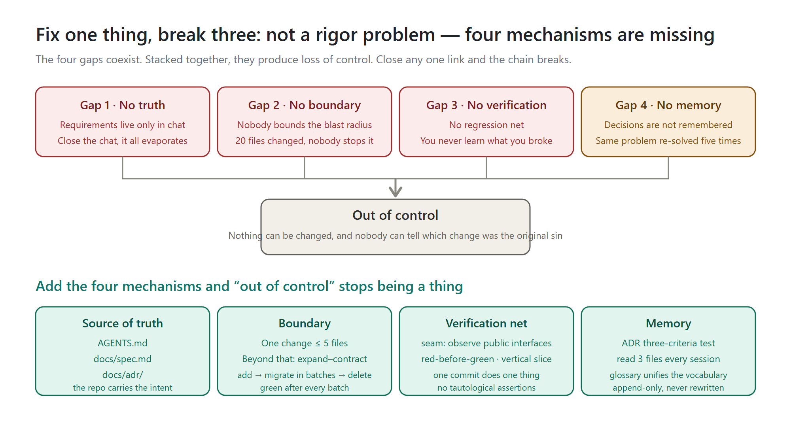
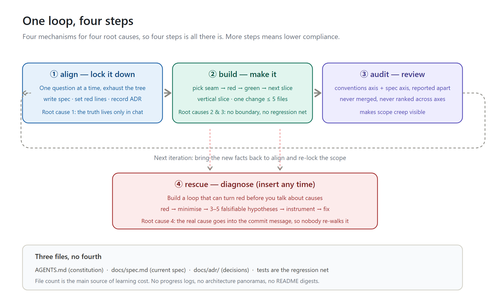

# AI Coding Governance: A Minimal Set of Rules and Methodology

**From "fix one thing, break three" to "fix one thing, break at most one"**

Version V1.1 EN | 2026-10-06 | MIT License

---

## How to use this document

**For the AI:** put this file in the project root (recommended name: `AI-CODING-RULES.md`), and add one line to `AGENTS.md`:

```
Before starting any work, read AI-CODING-RULES.md in full and treat it as a hard constraint of this project.
```

**For humans:** before starting work, read Section 1 (the four mechanisms) and Section 6 (the cheat sheet). Look up the rest as needed.

**Why you need it:** AI writes code fast, but "fix one thing, break three" doesn't mean the AI got dumber — it means **mechanisms are missing**. This document gives you four mechanisms, four actions, and three files. Every rule is open-source and traceable.

---

## 1. The four mechanisms: why one fix breaks three things

Projects that spiral out of control mid-to-late in their life usually have all four gaps at once. It is their combination that produces "it can't be changed anymore, and nobody can say which change was the original sin."



### How to read this figure

The top half shows **the four gaps** — the four sources of losing control. The bottom half shows **the four matching mechanisms**. They map one to one: close a mechanism, plug the corresponding gap.

### Gap 1: The truth lives only in the conversation → Mechanism 1 "Source of truth"

Requirements, decisions, "why isn't it written that way" — all of it exists only in the chat history.

Close the conversation and everything evaporates. The next agent (or you, next week) opens the project and sees only the resulting code, **with no way to read the intent**. So it guesses. It guesses wrong and you don't notice — because there is nothing to check against.

> This is the first layer of "break three": the edit isn't wrong because of skill — it's wrong because **at the moment of editing, nobody knew what semantics they were changing**.

**Mechanism fix:** write the decisions into the repository, and let the repo carry its own intent. See Section 2, "Source of truth."

### Gap 2: Nobody bounds the blast radius → Mechanism 2 "Boundary"

Human engineering teams have code review as the backstop: change 20 files and the reviewer will inevitably ask "why this?"

AI writes code faster than review can keep up. A 20-file change lands in one shot; nobody can read it line by line.

**The consequence is not "there are bugs." It is "nobody knows which bugs this change introduced."** When tests fail you can't tell new breakage from old, `git log` is a mess, and problems can't be bisected.

**Mechanism fix:** give every change a **visible quantity**, and when it's exceeded, change strategy. See Section 2, "Boundary."

### Gap 3: No regression net → Mechanism 3 "Verification net"

No tests, or only a few smoke tests where "it runs, so it passes."

Every change is then a **gamble**: after editing, you don't know what else you broke, so you click through by hand. The bugs you find get fixed; the ones you don't find stay buried.

**The bigger the project, the higher the odds of losing the bet.** That's why projects "lose control at the end" — problems didn't appear at the end; they were only discovered there.

**Mechanism fix:** hang tests on **public interfaces**, red before green. See Section 2, "Verification net."

### Gap 4: Decisions are not remembered → Mechanism 4 "Memory"

The third agent meets the fifth occurrence of an old problem, asks about it again, and makes a different choice from last time.

**Inconsistent implementations of the same thing scatter across the codebase**, and nobody can say which one is right. This is the second layer of "break three": one bug exists in three implementations; you fix one, two remain.

**Mechanism fix:** record "why it was decided this way" in ADRs, and unify the vocabulary with a glossary. See Section 2, "Memory."

---

## 2. How to put the four mechanisms in place

### Mechanism 1: Source of truth — three files, no fourth

| File | What goes in | When to write it | Life cycle |
|---|---|---|---|
| `AGENTS.md` (root) | The project constitution: how to build, how to test, **non-negotiable red lines**, project-specific terms | With the first version of the project | Written once, then rarely touched |
| `docs/spec.md` | This version's spec: what "done" looks like, acceptance checklist, **what this version explicitly does not do** | Before every work session | Rewritten every time |
| `docs/adr/NNNN-*.md` | Decision records: one decision + why | Only when all three criteria hit | Append-only |

**There is no fourth kind of file.** No progress logs, no architecture panoramas, no README digests.

> **Why: file count is the primary source of learning cost.** Three files can be memorized at a glance; with eight files, each one first demands "which file does this go in?"

**The fourth item is the tests.** They are not documents, but they are the regression net itself.

#### The key: what `docs/spec.md` says and doesn't say

```markdown
# This version's spec: users can revoke a submitted order

## What "done" looks like
The user clicks "Request revoke" on the order detail page; the order enters
"revocation under review". An admin sees the review queue in the back office
and can approve or reject. On approval the order returns to "cancelled";
on rejection it returns to its previous state and the user is notified.

## Acceptance checklist
- [ ] Only orders that are "paid and not yet shipped" can enter revocation
- [ ] Clicking revoke on a shipped order shows "cannot revoke after shipping"
      and sends no request
- [ ] After rejection, the user receives an in-app notification
- [ ] Clicking "Request revoke" twice does not create a second record

## Explicitly out of scope for this version
- No refund flow (next version)
- No bulk revocation
- No mobile layout changes

## What needs to change
- Order state machine (two new states and their legal transitions)
- Order detail page action area (new revoke entry point)
- Back-office review queue (new list page)
```

**The wrong way to write it:**

```markdown
## What needs to change
- Add a status field to the Order entity; extend the enum with
  ORDER_REVOKING and ORDER_REVOKE_REJECTED
- Modify src/order/service/order-service.ts
- Add src/order/api/revoke-controller.ts
```

What's the difference? **The first describes behavior and acceptance; the second describes implementation.**

File paths and code snippets are **correct today and stale tomorrow** — putting them in a spec only turns it into misinformation. A spec must still be readable three months later.

#### `AGENTS.md`: one screen, max

```markdown
# Project constitution

## How to understand this project
Build: `pnpm build`   Test: `pnpm test`   Single test: `pnpm test <file>`
Type check: `pnpm typecheck` (must pass before every commit)
Layout: `src/domain/` business rules · `src/api/` interfaces · `src/infra/` external deps

## Red lines (crossing them counts as a bug)
- Business code must never import anything outside `src/infra/` directly;
  everything goes through `src/api/`
- No business logic in controllers; it must be pushed down into `src/domain/`
- Before adding a utility function, search `src/utils/` first — no duplicates

## Glossary
**Order**: the transaction created when a user checks out; state machine in docs/spec.md
**Revoke**: available while paid and not yet shipped; enters review. Unlike
"cancel", it does not trigger a refund
```

**If it no longer fits one screen, cut it.** It is loaded in every session; bloat is waste.

### Mechanism 2: Boundary — one change touches ≤ 5 files

**This is the only rule that must be enforced, and the single most important rule in the whole method.**

Beyond 5 files, **do not edit directly**. Switch to **expand–contract** instead:

1. **Expand**: add the new shape alongside the old one. The old code keeps working; nothing breaks.
2. **Migrate**: move call sites over in batches, by directory or package — one batch per commit, **green after every batch**.
3. **Contract**: once nothing calls the old shape anymore, delete it.

In plain words: **don't change everything at once.**

> 20% slower, but it never leaves you unable to turn back halfway.

**What counts as "one change":** one commit = one logical change. If your commit message needs "and also", "by the way", or "at the same time", split it.

> **Why 5?** It's not math, it's an experience threshold: a 5-file diff a human can still read in one pass; 20 files cannot be read. The point is not the number 5 — it's the trigger: "**when you exceed it, change strategy**."

### Mechanism 3: Verification net — seam + red-before-green + vertical slices

#### The seam

> **A seam = a public interface where you can observe behavior without reaching inside. Write tests only at seams; never test internal implementation.**

- Prefer **already existing** public interfaces
- When you need a new seam, open it **at as high a level as possible**
- **Fewer seams is better**; ideally one
- **The seam's location must be confirmed with the user first**

This solves the sneakiest layer of "break three": **tests hung on internal implementation all turn red at the first refactor, the red makes you revert blindly** — and then, to keep the tests green, you stop refactoring and the code calcifies.

#### Good tests vs bad tests

```typescript
// Good: verifies behavior through a public interface; survives refactoring
test("user can check out with a valid cart", async () => {
  const cart = createCart();
  cart.add(product);
  const result = await checkout(cart, paymentMethod);
  expect(result.status).toBe("confirmed");
});

// Bad: asserts internal calls; breaks on the first refactor
test("checkout calls paymentService.process", async () => {
  const mock = jest.mock(paymentService);
  await checkout(cart, payment);
  expect(mock.process).toHaveBeenCalledWith(cart.total);
});
```

Red flags of a bad test: mocking internal collaborators, testing private methods, asserting call counts, bypassing the interface to poke the database.

And one more subtle bad test — **the tautology**:

```typescript
// Bad: the expectation recomputes itself with the implementation's own
// algorithm — it can never fail
test("calculateTotal sums line items", () => {
  const items = [{ price: 10 }, { price: 5 }];
  const expected = items.reduce((sum, i) => sum + i.price, 0);
  expect(calculateTotal(items)).toBe(expected);
});

// Good: the expectation is an independent known truth
test("calculateTotal sums line items", () => {
  expect(calculateTotal([{ price: 10 }, { price: 5 }])).toBe(15);
});
```

**Tautological tests give false confidence** — they pass under every implementation, including a completely wrong one. This is a leading cause of "we have tests and still lost control."

#### Red before green

1. **Red**: write one failing test first — only this one. **If you haven't watched it fail, you may not move on.**
2. **Green**: write only the code that makes this one test pass. Do not sneak in the next feature.
3. **Next slice**: repeat. Every slice is a **tracer round** — it passes through every layer, and you can see where it lands.

Refactoring does **not** belong in this loop; it belongs to the acceptance stage.

#### Vertical slices, not horizontal slices

**Vertical slice** = one minimal loop connected end to end, from data to UI — done means demoable and acceptable.
**Horizontal slice** = write all the models first, then all the APIs, then all the screens.

Why is horizontal dangerous? Because **nothing runs until the last layer is finished**, and that's when you discover the bottom layer was misunderstood — the rework is 100% of the work.

> One commit does one thing. A clean `git log` is the watershed between an AI project that keeps iterating and one that doesn't.

### Mechanism 4: Memory — the ADR three-criteria test + glossary

#### When to write an ADR: all three, or nothing

1. **Hard to reverse** — changing your mind later would cost a lot
2. **Surprising without context** — people who come later will ask "why is it this way?"
3. **A real trade-off** — there genuinely were other options, and this one was chosen for stated reasons

Only when **all three** hold, write it. **Missing one means don't write it.**

```markdown
# Use PostgreSQL as the primary store for the write model

Orders and inventory need strong consistency, and we already run Postgres
operations and backups. Chosen over MySQL mainly because JSONB makes storing
order snapshots easier, and it leaves more room for geographic partitioning.
```

**An ADR can be a single paragraph.** The value is "we made this decision, and here's why" — not filling out chapters.

**This is the easiest mechanism to overdo.** Turn every tuning tweak and every renamed column into an ADR, and three months later `docs/adr/` has 200 files — worse than writing none.

#### Glossary: only project-specific words

```markdown
**Order**: the transaction created when a user checks out
**Revoke**: a user-initiated "under review" state; unlike "cancel",
it does not trigger a refund
_Avoid_: refund, withdraw
```

- **When several words name the same concept, pick one and put the rest under `_Avoid_`**
- One or two sentences per definition; say what it **is**, not what it **does**
- **Never list generic programming concepts** (timeouts, error types, utility classes), no matter how often they appear

The glossary's value is **removing ambiguity**. When the same concept has two names in the code, sooner or later one of them gets edited wrongly.

---

## 3. One loop: four steps



### How to read this figure

The top three boxes are the main loop: `① align lock → ② build make → ③ audit review`, then **back to align** for the next round (dashed line).

The fourth box, `④ rescue`, is not on the main loop — it **plugs in at any moment**. Whenever any step hits "it won't run / the result is wrong", switch to rescue immediately, finish, and return to where you were.

Each box is annotated with **which root cause it treats**, and that is what decides whether it can be skipped. Four mechanisms for four root causes — that's why four steps is all there is.

### What each step does

| Step | What it does | Output | When it can be skipped |
|---|---|---|---|
| **① align** | One question at a time; exhaust the decision tree | Updated `docs/spec.md`, an ADR (if all three criteria hit), `AGENTS.md` red lines | Trivial edits (e.g. copy change) |
| **② build** | Pick seam → red → green → next slice | Code + tests | **Never skip** |
| **③ audit** | Dual-axis review, reported apart | Conventions-axis report + spec-axis report | Docs-only changes |
| **④ rescue** | Build a loop that can turn red → minimize → hypothesize → instrument → fix | Regression test + commit message stating the true cause | **Never skip** |

**More steps means lower compliance.** That is the only reason there are exactly four — not because four is perfect, but because four can actually be remembered.

### align: the four disciplines of grilling

This is the shortest distillation of the open-source methodology, and **it needs no supporting documents at all**:

1. **Ask one question at a time.** Fire off five questions and you get five throwaway answers.
2. **Attach your recommended answer to every question.** Let the other person just say "do as you suggested" instead of building from zero.
3. **Never ask what you can look up.** The user's time is more expensive than yours, and most "how does this currently work" can be read straight from the code.
4. **Depth first; exhaust the decision tree.** Finish one branch before opening the next.

When the questions are done, **summarize once**, and only start after the other side confirms "we agree."

Suggested question order (skip what doesn't apply): **domain** (what does this word actually mean) → **behavior** (what counts as done; what gets accepted) → **technology** (does the stack change) → **scope** (what does this version explicitly not do) → **UI** (only when there are screens).

> ⚠️ **Skipping confirmation is the single truly fatal mistake in this whole system.** Start before confirmation and everything after is wasted.

### audit: the two axes must be reported separately

**Watching only code quality is not enough.** Every change must pass two gates, and neither substitutes for the other:

- **Conventions axis**: does it follow the rules this project set for itself?
- **Spec axis**: does it do what was agreed at the start of this round?

**Why separate rather than merged?**

- Beautiful code that does the wrong thing → conventions pass, **spec fails**
- Code that implements the spec but violates project conventions → spec passes, **conventions fail**

Merge the reports and they mask each other: pile up enough style nits and the one real "did the wrong thing" drowns. Reported apart, the reader can tell at a glance whether this round was a **direction problem** or a **craft problem**.

Review in this order: pin the baseline (`git diff <baseline>...HEAD`) → find the spec → find the project conventions → report the two axes separately → summarize separately, **never crown a single champion across axes**.

### rescue: build the loop first, guess causes later

**This rule saves the most money in the entire method.**

The goal is a verdict command that **turns red on this bug and green once fixed**. It must be: able to go red (it runs the real failing path and asserts the symptom the user described), deterministic, fast, and runnable unattended.

Try these in order; stop at the first hit: failing test → curl/HTTP script → CLI with fixed input → headless-browser script → replay the scene → a one-off target → fuzzing → automated bisection → differential loop → manual script.

Once you have it, **tighten it**: faster, more precise, more stable.

> ⚠️ **If you're reading code and making up stories before a loop exists, stop.** No red command, no hypotheses.

After you have the loop: reproduce and **minimize** (cut until every piece is indispensable) → **list 3–5 falsifiable hypotheses** and rank them → show the user before touching anything → change one variable at a time → **write the regression test before the fix** → when closing out, write **the hypothesis that actually held** into the commit message.

**If no correct seam exists, that itself is a finding** — the code's structure is preventing this bug from being pinned down. Note it; don't pretend there's a test.

---

## 4. The executive summary for the AI

> Copy-paste the block below to the AI directly, or put it at the top of `AGENTS.md`.

```
You work in this project under the following hard constraints.
They take priority over your defaults.

[At the start of every session]
Read AGENTS.md, docs/spec.md, and docs/adr/ first. Only then act.
For anything unclear, read the code first; don't ask the user.

[When asking questions]
Ask one question at a time, and attach your recommended answer.
Anything answerable with grep / reading files, look up yourself.

[Before touching code]
Confirm the scope. Until the user says "go ahead", write no code.

[While writing code]
- One change touches at most 5 files. Beyond that, split first; if it can't
  be split, use expand–contract: add the new shape alongside → migrate in
  batches (green after each) → delete the old once nothing calls it.
- Tests observe behavior only through public interfaces. No mocking internal
  collaborators, no testing private methods.
- Expected values must come from an independent source (a hand-worked example,
  a literal, a line in the spec) — never recomputed with the implementation's
  own algorithm. That's a tautology; it can never fail.
- Write the failing test first, watch it turn red, then write the code that
  makes it pass.
- Build vertical slices — one slice through the whole stack. Never write all
  the models first and all the APIs after.

[Forbidden]
- Don't touch code outside this change's scope. If you spot another problem,
  write it down and tell the user; wait for their decision.
- Don't do two things at once. Anything that deserves "by the way" goes in
  the report instead.
- Don't put file paths or code snippets in the spec. They go stale and turn
  into misinformation.
- Don't claim "tests pass" before you have watched them fail and then pass.
- Don't propose a cause for a bug without a runnable feedback loop.

[When committing]
One commit does one thing. The commit message says "why", not "what changed".
If a specific hypothesis is what actually cracked a bug, put it in the message.
```

---

## 5. Why this method survives real iteration

### The cost is low enough to actually be followed

Four hard rules, three files, four actions. **The test of a methodology is not how complete it is — it's whether the executor actually follows it.** A methodology that takes 20 files to memorize has a compliance rate of zero.

### Every iteration accumulates instead of restarting

`docs/adr/` is append-only, `AGENTS.md` occasionally gains a red line, `docs/spec.md` is rewritten each round.

Three months in, what you hold is not a pile of scattered chat logs but **a portable project asset**. The next agent aligns by reading three files.

### Losing control becomes visible early

The dual-axis review explicitly reports "present in the diff, absent from the spec." **Scope creep becomes visible** — instead of surfacing three months later as "why is this code so hard to understand."

### The backstop: git is the last line of defense

Beyond the methodology, always keep:

- One commit does one thing
- `git status` clean before every work session
- The main branch revertable at any moment

**This one has nothing to do with the methodology, but it is the only lifeline when every rule fails.**

---

## 6. Cheat sheet

### The four hard rules

1. **One commit does one thing**
2. **One change touches at most 5 files** — beyond that, expand–contract (add the new → migrate in batches → delete the old)
3. **No red test, no implementation changes**
4. **The spec explicitly states what this version does NOT do**

### The three questions to answer before starting

1. **What does "done" look like?** (an acceptance checklist, every item visible and checkable)
2. **What must not be crossed?** (red lines — crossing one is a bug)
3. **Why was this decided this way?** (record an ADR only when all three criteria hit)

### The four-step loop

**align (lock) → build (make) → audit (review) → rescue (diagnose, any time)**

### Four mechanisms for four root causes

| Root cause | Mechanism | What lands in the repo |
|---|---|---|
| The truth lives only in chat | Source of truth | `AGENTS.md` / `docs/spec.md` / `docs/adr/` |
| Nobody bounds the blast radius | Boundary | ≤ 5 files + expand–contract |
| No regression net | Verification | seam + red-before-green + vertical slices |
| Decisions are not remembered | Memory | ADR three-criteria test + glossary + the three files read every session |

---

## 7. Open-source origins and license

This document is an original synthesis. Every mechanism is distilled from the following **open-source** projects (all MIT-licensed) and can be independently checked:

| Source | What was adopted |
|---|---|
| [mattpocock/skills](https://github.com/mattpocock/skills) | the grilling method, glossary & ADR three-criteria test (domain-modeling), the seam concept & good/bad tests (tdd), feedback loops (diagnosing-bugs), dual-axis review (code-review), expand–contract (to-tickets) |
| [Fission-AI/OpenSpec](https://github.com/Fission-AI/OpenSpec) | the "truth vs proposal" split of specs / changes, delta-style incremental writing |
| [github/spec-kit](https://github.com/github/spec-kit) | the constitution concept, spec as the single source of truth |
| [sverweij/dependency-cruiser](https://github.com/sverweij/dependency-cruiser) | the idea of machine-checkable dependency boundaries (the advanced form of the "≤ 5 files" rule) |

**This document is released under the MIT License.** Keep the attribution when quoting, adapting, or redistributing.

---

**One-sentence summary:** losing control is not a rigor problem — it's a missing-mechanism problem. Add the four mechanisms and "out of control" stops being a thing.
